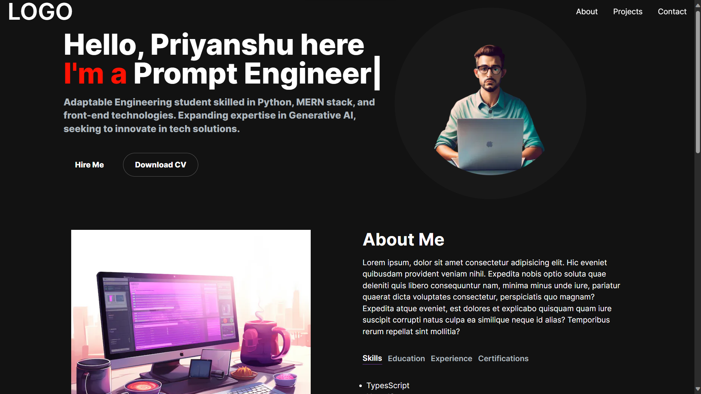

# My Portfolio

> A personal portfolio website showcasing my projects and skills.

## Table of Contents

- [Description](#description)
- [Features](#features)
- [Technologies Used](#technologies-used)
- [Installation](#installation)
- [Usage](#usage)
- [Screenshots](#screenshots)
- [License](#license)

## Description

This project is a personal portfolio website created to showcase my projects, skills, and expertise as a developer. It provides an interactive platform for visitors to explore my work and get to know more about me.

## Features

- **Project Showcase**: Display a curated selection of my completed projects with descriptions and live demos (if available).
- **Skills Section**: Highlight my technical skills, programming languages, and tools I'm proficient in.
- **Contact Information**: Provide ways for visitors to get in touch with me, such as through email or social media links.
- **About Me**: Share a brief biography and introduction to give visitors context about who I am and what I'm passionate about.

## Technologies Used

- **Next.js**: A React-based framework for building modern web applications.
- **TypeScript**: A statically typed superset of JavaScript that enhances code maintainability and reliability.
- **[Add other technologies used]**

## Installation

1. Clone the repository: `git clone https://github.com/your-username/my-portfolio.git`
2. Navigate to the project directory: `cd my-portfolio`
3. Install dependencies: `npm install`

## Usage

1. Start the development server: `npm run dev`
2. Open your browser and go to `http://localhost:3000`

## Deploy on Vercel

The easiest way to deploy your Next.js app is to use the [Vercel Platform](https://vercel.com/new?utm_medium=default-template&filter=next.js&utm_source=create-next-app&utm_campaign=create-next-app-readme) from the creators of Next.js.

Check out our [Next.js deployment documentation](https://nextjs.org/docs/deployment) for more details.
