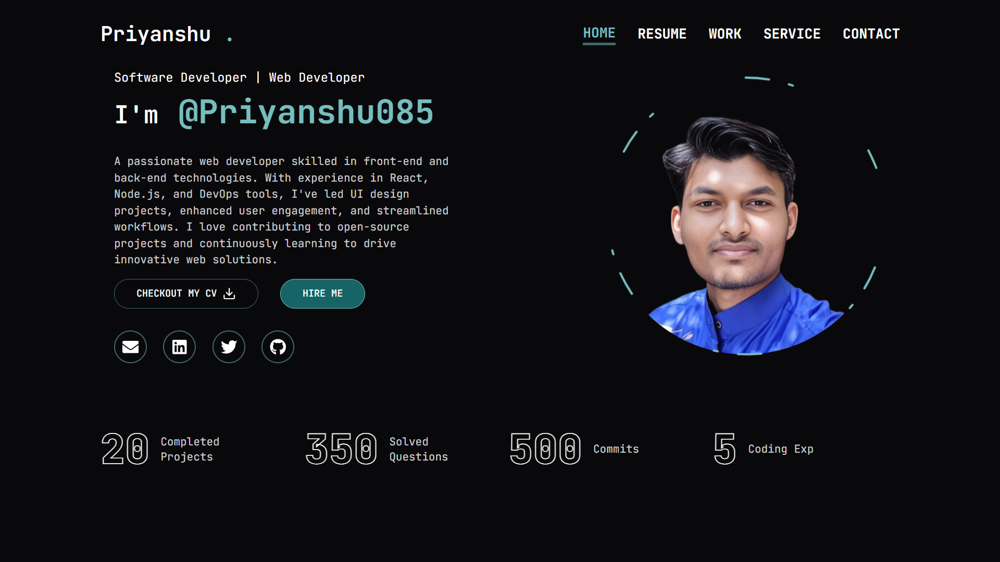

# Portfolio Website 🚀

A modern, animated portfolio website built with Next.js 14, React 18, and TypeScript, featuring interactive components and sleek animations.

<div align="center">
  
</div>

## 🛠️ Tech Stack

### 1. Core
[](https://nextjs.org/)
[](https://reactjs.org/)
[](https://www.typescriptlang.org/)

### 2. UI & Styling
[](https://tailwindcss.com/)
[](https://www.radix-ui.com/)
[](https://www.framer.com/motion/)

### 3. Features & Analytics
[](https://www.npmjs.com/package/react-type-animation)
[](https://www.npmjs.com/package/react-countup)

### 4. Contact Form
[](https://react-hook-form.com/)
[](https://www.resend.com/)

### 3. DevOps & Tools
[](https://eslint.org/)
[](https://prettier.io/)
[](https://typicode.github.io/husky/)
[](https://www.docker.com/)


## 🚀 Quick Start

### Standard Setup

1. **Clone & Install**
```bash
git clone https://github.com/Coderx85/portfolio.git
cd portfolio
npm install
```

2. **Setup Environment**
Create a `.env.local` file with:
```
RESEND_API_KEY=your_resend_api_key
```

3. **Development**
```bash
npm run dev
```

Visit [http://localhost:3000](http://localhost:3000)

4. **Build & Deploy**
```bash
npm run build
npm start
```

### Docker Setup

You can also run this portfolio using Docker:

```bash
# Build Docker image
docker build -t portfolio .

# Run Docker container
docker run -p 3000:3000 -e RESEND_API_KEY=your_resend_api_key portfolio
```

Visit [http://localhost:3000](http://localhost:3000)

For detailed Docker instructions, see [README.docker.md](README.docker.md).

## 📄 License

MIT © [Priyanshu](mailto:abpriyanshu085@gmail.com)

## 🤝 Connect With Me

- GitHub: [Coderx85](https://github.com/Coderx85)
- Email: [abpriyanshu085@gmail.com](mailto:abpriyanshu085@gmail.com)
